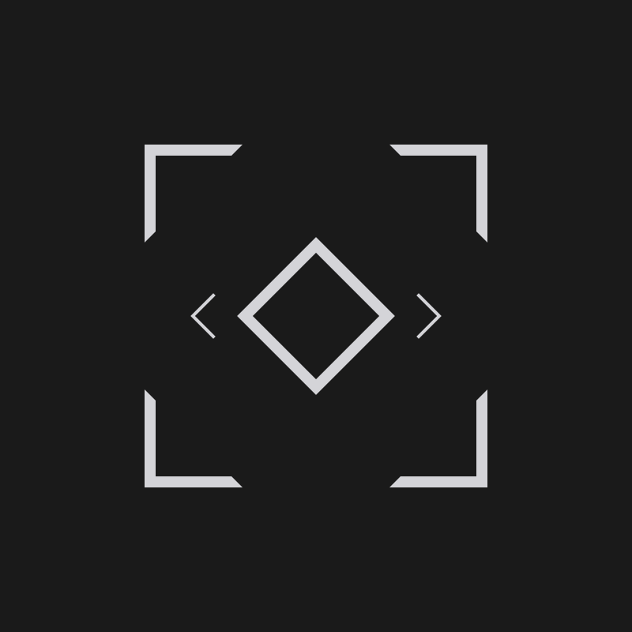
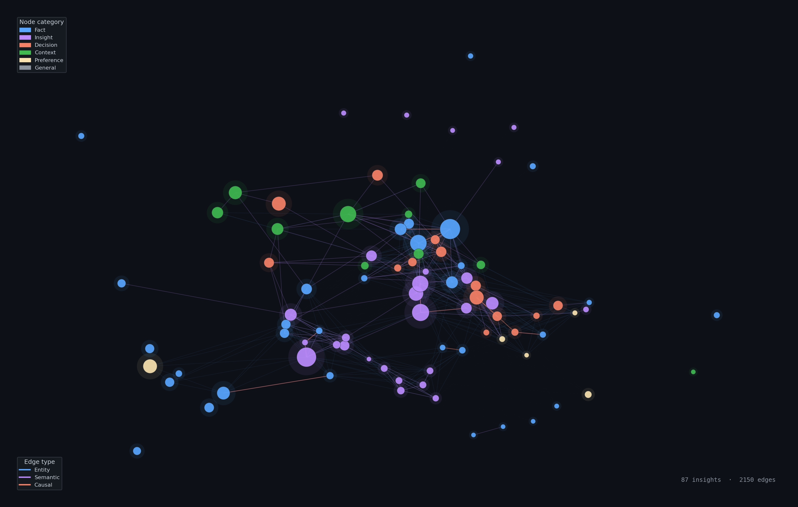

<p align="center">
  
</p>

# Mnemon

**LLM-supervised persistent memory for AI agents.**

[](https://github.com/bissli/mnemon/actions/workflows/ci.yml)
[](LICENSE)

---

LLM agents forget everything between sessions. Context compaction drops critical decisions, cross-session knowledge vanishes, and long conversations push early information out of the window.

Mnemon gives your agent persistent, cross-session memory — a four-graph knowledge store with intent-aware recall, importance decay, and automatic deduplication. Zero API keys, one setup command.

> **Claude Max / Pro subscriber?** Mnemon works entirely through your existing subscription — no separate API key required. Your LLM subscription *is* the intelligence layer. Two commands and you're done.

### Why Mnemon?

Most memory tools embed their own LLM inside the pipeline. Mnemon takes a different approach: **your host LLM is the supervisor.** The binary handles deterministic computation (storage, graph indexing, search, decay); the LLM makes judgment calls (what to remember, how to link, when to forget). No middleman, no extra inference cost.

| Pattern            | LLM Role                                   | Representative     |
| ------------------ | ------------------------------------------ | ------------------ |
| **LLM-Embedded**   | Executor inside the pipeline               | Mem0, Letta        |
| **File Injection** | None — reads file at session start         | Claude Code Memory |
| **MCP Server**     | Tool provider via MCP protocol             | claude-mem         |
| **LLM-Supervised** | External supervisor of a standalone binary | **Mnemon**         |

Mnemon also addresses a gap in the protocol stack. MCP standardizes how LLMs discover and invoke tools. ODBC/JDBC standardizes how applications access databases. But how LLMs interact with databases using memory semantics — this layer has no protocol. Mnemon's three primitives — `remember`, `link`, `recall` — form an intent-native protocol: command names map to the LLM's cognitive vocabulary (`remember` not INSERT, `recall` not SELECT), and output is structured JSON with signal transparency rather than raw database rows.

<p align="center">
  
  <br />
  <sub>The LLM-Supervised pattern: hooks drive the lifecycle, the host LLM makes judgment calls, the binary handles deterministic computation.</sub>
</p>

Memory has a **compound interest effect** — the longer it accumulates, the greater its value. LLM engines iterate constantly, skill files cost nearly nothing to write, but memory is a private asset that grows with the user. It is the only component in the agent ecosystem worth deep investment.

<p align="center">
  
  <br />
  <sub>A real knowledge graph built by Mnemon — 87 insights, 2150 edges across four graph types.</sub>
</p>

See [Design & Architecture](docs/DESIGN.md) for details.

## Quick Start

### Install

**From source (Poetry)**:

```bash
git clone https://github.com/bissli/mnemon.git && cd mnemon
make install
```

**Development**:

```bash
git clone https://github.com/bissli/mnemon.git && cd mnemon
make dev
```

### Claude Code

```bash
mnemon setup
```

`mnemon setup` auto-detects Claude Code, then interactively deploys skill, hooks, and behavioral guide. Start a new session — memory just works.

### [OpenClaw](https://github.com/openclaw/openclaw)

```bash
mnemon setup --target openclaw --yes
```

One command deploys skill, hook, plugin, and behavioral guide to `~/.openclaw/`. Restart the OpenClaw gateway to activate.

### [NanoClaw](https://github.com/qwibitai/nanoclaw)

NanoClaw runs agents inside Linux containers. Use the `/add-mnemon` skill to integrate:

1. Install mnemon on the host (see above)
2. In your NanoClaw project, run `/add-mnemon` — Claude Code will modify the Dockerfile, add a container skill, and set up volume mounts
3. Each WhatsApp group gets its own isolated memory store, with optional global shared memory (read-only)

The skill is available at `.claude/skills/add-mnemon/` in the NanoClaw repo.

### Uninstall

```bash
mnemon setup --eject
```

## How it works

Once set up, memory operates transparently — you use your LLM CLI as usual. Mnemon integrates via Claude Code's [hook system](https://docs.anthropic.com/en/docs/claude-code/hooks), injecting memory operations at key lifecycle points:

```
Session starts
    │
    ▼
  Prime (SessionStart) ─── prime.sh ──→ load guide.md (memory execution manual)
    │
    ▼
  User sends message
    │
    ▼
  Remind (UserPromptSubmit) ─── user_prompt.sh ──→ remind agent to recall & remember
    │
    ▼
  LLM generates response (guided by skill + guide.md rules)
    │
    ▼
  Nudge (Stop) ─── stop.sh ──→ remind agent to remember
    │
    ▼
  (when context compacts)
  Compact (PreCompact) ─── compact.sh ──→ flag file for post-compact recall
```

Five hooks drive the memory lifecycle. **Prime** loads the behavioral guide — a detailed execution manual for recall, remember, and sub-agent delegation. **Remind** prompts the agent to evaluate recall and remember before starting work. **Nudge** reminds the agent to consider remember after finishing work. **Compact** bridges context across compaction via a two-part relay: `compact.sh` writes a flag file at PreCompact time, then `prime.sh` detects the post-compact SessionStart and injects a recall instruction the agent can see. **Recall** reminds the agent to recall before delegating to sub-agents. **The skill file** teaches command syntax. **The guide** (`~/.mnemon/prompt/guide.md`) defines the detailed rules for when to recall, what to remember, and how to delegate.

You don't run mnemon commands yourself. The agent does — driven by hooks and guided by the skill and behavioral guide.

## Features

- **Zero user-side operation** — install once, memory runs in the background via hooks
- **LLM-supervised** — the host LLM decides what to remember, update, and forget; no embedded LLM, no API keys
- **Hook-based integration** — five lifecycle hooks: Prime (load guide), Remind (recall & remember), Nudge (remember), Compact (bridge context across compaction), and Recall (pre-delegation)
- **Four-graph architecture** — temporal, entity, causal, and semantic edges, not just vector similarity
- **Intent-native protocol** — three primitives (`remember`, `link`, `recall`) map to the LLM's cognitive vocabulary, not database syntax; structured JSON output with signal transparency
- **Intent-aware recall** — graph traversal + optional vector search (RRF fusion), enabled by default for all queries
- **Built-in deduplication** — `remember` auto-detects duplicates and conflicts; skips or auto-replaces
- **Retention lifecycle** — importance decay, access-count boosting, and garbage collection
- **Optional embeddings** — works fully without Ollama; add local [Ollama](https://ollama.ai) for enhanced vector+keyword hybrid search

## Vision

All your local agentic AIs — across sessions and frameworks — sharing one pool of live memory.

```
  Claude Code ──┐
                │
  OpenClaw ─────┤
                │
  NanoClaw ─────┤
                ├──▶  ~/.mnemon  ◀── shared memory
  OpenCode ─────┤
                │
  Gemini CLI ───┘
```

The foundation is in place: a single `~/.mnemon` database that any agent can read and write. Claude Code's hook integration is the reference implementation; OpenClaw uses a plugin-based approach; NanoClaw integrates via container skills and volume mounts. The same pattern can be replicated for any LLM CLI that supports event hooks or system prompts.

The longer-term direction is a **memory gateway**: protocol decoupled from storage engine. The current SQLite backend is the first adapter; the protocol surface (`remember / link / recall`) can sit on top of PostgreSQL, Neo4j, or any graph database. Agent-side optimization (when to recall, what to remember) and storage-side optimization (indexing, graph algorithms) evolve independently. See [Future Direction](docs/design/08-decisions.md#82-future-direction) for details.

## FAQ

**Do different sessions share memory?**
Yes. By default, all sessions use the same `default` store — a decision remembered in one session is available in every future session.

**Can I isolate memory per project or agent?**
Yes. Use named stores to separate memory:

```bash
mnemon store create work        # create a new store
mnemon store set work           # set as default
MNEMON_STORE=work mnemon recall "query"  # or use env var per-process
```

Different agents/processes can use different stores via the `MNEMON_STORE` environment variable — no global state contention.

**Local or global mode?**
`mnemon setup` defaults to **local** (project-scoped `.claude/`), recommended for most users. **Global** (`mnemon setup --global`, installed to `~/.claude/`) activates mnemon across all projects — convenient if you want other frameworks (e.g., OpenClaw) to share memory by forwarding requests through Claude Code CLI, but may add maintenance overhead.

**How do I customize the behavior?**
Edit `~/.mnemon/prompt/guide.md`. This file controls when the agent recalls memories and what it considers worth remembering. The skill file (`SKILL.md`) is auto-deployed and should not need manual editing.

**What is sub-agent delegation?**
Memory writes don't happen in the main conversation. The host LLM (e.g., Opus) decides *what* to remember, then delegates the actual `mnemon remember` execution to a lightweight sub-agent (e.g., Sonnet). This saves tokens and keeps memory operations out of the main context.

## Configuration

| Environment Variable | Default                      | Description                           |
| -------------------- | ---------------------------- | ------------------------------------- |
| `MNEMON_DATA_DIR`    | `~/.mnemon`                  | Base data directory                   |
| `MNEMON_STORE`       | *(active file or `default`)* | Named memory store for data isolation |

**Ollama-specific** (only relevant if using embeddings):

| Environment Variable    | Default                  | Description          |
| ----------------------- | ------------------------ | -------------------- |
| `MNEMON_EMBED_ENDPOINT` | `http://localhost:11434` | Ollama API endpoint  |
| `MNEMON_EMBED_MODEL`    | `nomic-embed-text`       | Embedding model name |

## Development

```bash
make dev            # editable install with dev deps
make test           # unit tests (pytest)
make e2e            # end-to-end test suite
make install        # production install (~/.local/share/mnemon/venv)
mnemon setup     # interactive setup
mnemon setup --eject  # remove all integrations
```

**Dependencies**: Python 3.11+, Click, httpx. **Optional**: Ollama with `nomic-embed-text` for embeddings.

## Documentation

- [Design & Architecture](docs/DESIGN.md) — philosophy, algorithms, integration design
- [Usage & Reference](docs/USAGE.md) — CLI commands, embedding support, architecture overview
- [Architecture Diagrams](docs/diagrams/) — system architecture, pipelines, lifecycle management

## References

Mnemon combines the paradigm of one paper with the methodology of another, grounded in the structural insight that graph memory is isomorphic to LLM attention. See [Theoretical Foundations](docs/DESIGN.md#25-theoretical-foundations) for details.

- **RLM** — Zhang, Kraska & Khattab. [Recursive Language Models](https://arxiv.org/abs/2512.24601). 2025. Establishes the paradigm: LLMs are more effective as orchestrators of external environments than as direct data processors.
- **MAGMA** — Zou et al. [A Multi-Graph based Agentic Memory Architecture](https://arxiv.org/abs/2601.03236). 2025. Provides the methodology: four-graph model (temporal, entity, causal, semantic) with intent-adaptive retrieval.
- **Graph-LLM Structural Insight** — Joshi & Zhu. [Building Powerful GNNs from Transformers](https://arxiv.org/abs/2506.22084). 2025; and the Graph-based Agent Memory survey (Chang Yang et al., 2026). Confirms that LLM attention is computationally equivalent to GNN operations — graph memory is a structural match, not an engineering convenience.

## License

[MIT](LICENSE)
